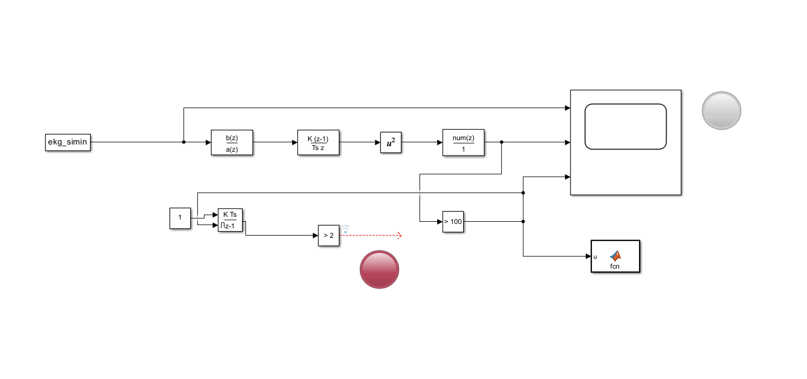
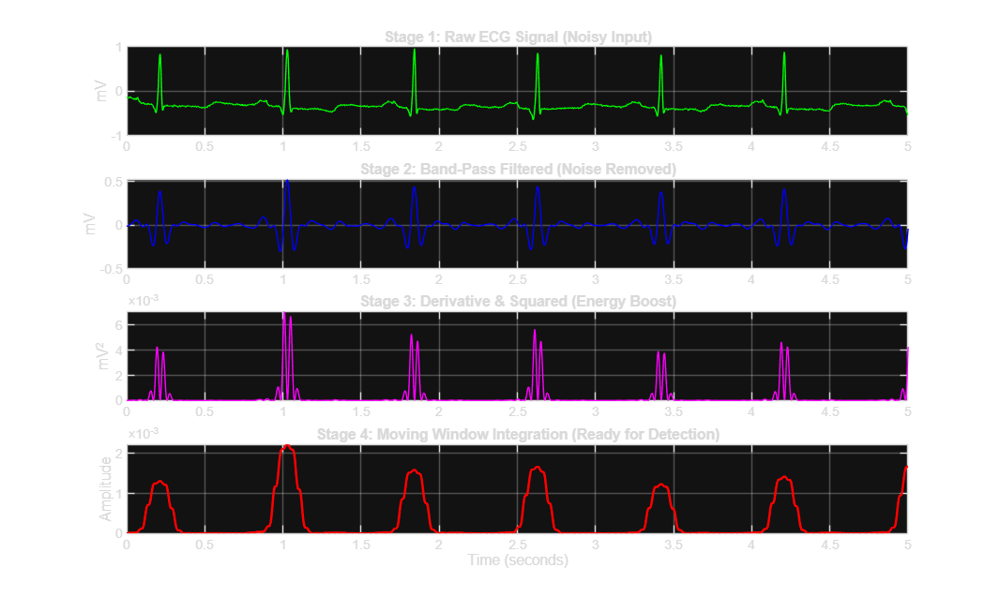
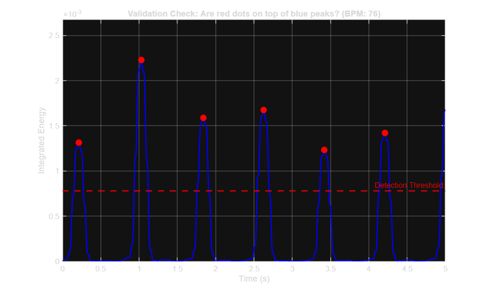
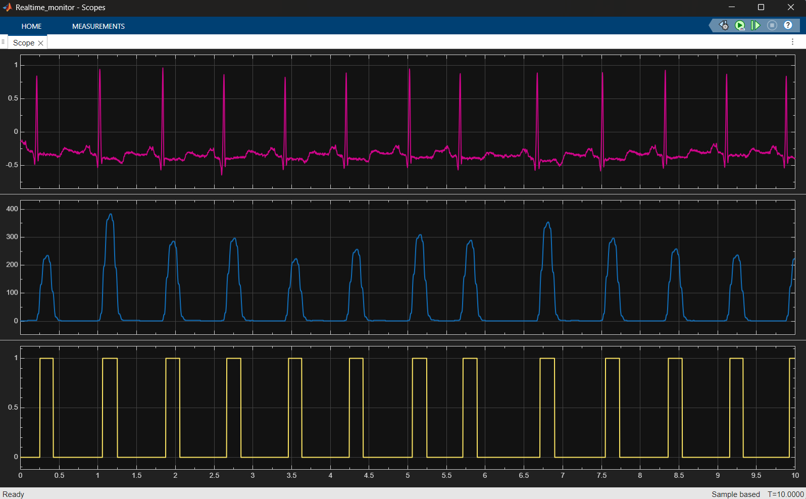
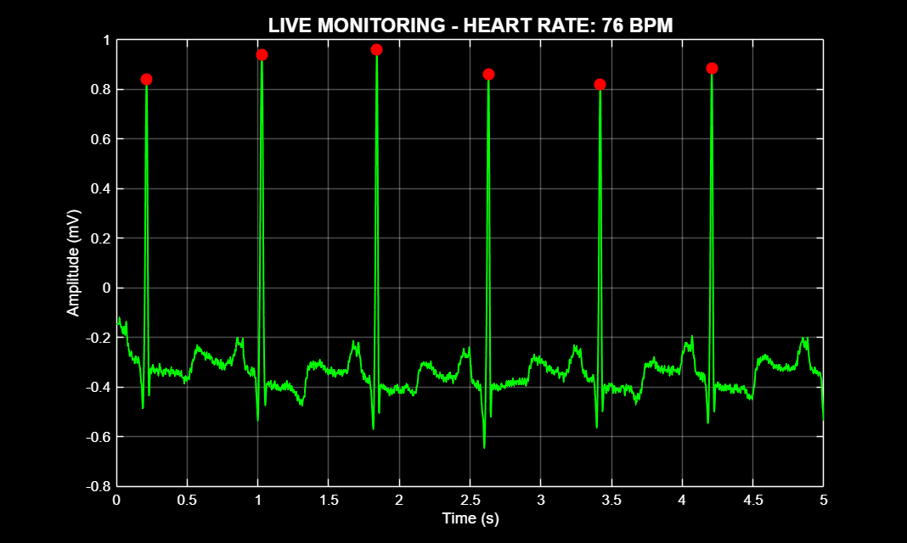

# Real-Time ECG Monitoring and Arrhythmia Detection System

## Project Overview
This project involves the design and implementation of a real-time patient monitoring system using MATLAB and Simulink. The primary objective is to process raw electrocardiogram (ECG) signals to detect R-peaks, calculate the Heart Rate (BPM) dynamically, and provide immediate audio-visual feedback. The system simulates a clinical environment by detecting normal sinus rhythms and potential asystole (cardiac arrest) conditions.

## System Features

### 1. Digital Signal Processing
* **Filtration:** Implementation of Butterworth band-pass filters to mitigate baseline wander and high-frequency noise from the raw ECG data.
* **Peak Detection:** Utilization of derivative, squaring, and moving window integration techniques (based on the Pan-Tompkins algorithm logic) for precise QRS complex detection.

### 2. Real-Time Simulation Architecture
* The model is configured with "Simulation Pacing" to ensure the execution matches wall-clock time, allowing for realistic monitoring simulation.

### 3. Safety and Alarm Mechanisms
* **Visual Indicators:**
    * 🟢 **Green Indicator:** Active during normal heart rhythm detection.
    * 🔴 **Red Indicator (Alarm):** Triggers automatically upon detection of signal loss or asystole condition.
* **Audio Feedback:** Generates a synchronized 1000Hz tone for every detected heartbeat using a custom MATLAB S-Function block to ensure auditory monitoring capability.

## Technologies and Tools
* MATLAB R202x
* Simulink
* DSP System Toolbox

## Screenshots

### 1. System Design (Simulink)
*(Block diagram demonstrating the signal flow from source to feedback mechanisms)*

### 2. Pre-Analysis & Algorithm Validation (MATLAB)
Before real-time implementation, the algorithm logic was validated using static data.

**Signal Processing Stage:**
*(Preprocessing and noise filtration of the raw ECG signal)*

**Algorithm Validation:**
*(Verification of R-Peak detection accuracy on static datasets)*

### 3. Real-Time Simulation Results (Simulink)
The following outputs demonstrate the system's performance during live simulation.

**Scope Output Analysis:**
*(Real-time visualization: Pink=Raw ECG, Blue=Integrated Signal, Yellow=Generated Pulse)*

**Live Monitoring Interface:**
*(Dashboard view showing continuous ECG waveform and heart rate tracking)*

## Installation and Usage
1.  Clone this repository or download the source files.
2.  Open MATLAB and set the path to the project directory.
3.  (Optional) Run the `main_analysis.m` script to load filter coefficients into the workspace.
4.  Open the `realtime_monitor.slx` file in Simulink.
5.  **Note:** Ensure "Simulation Pacing" is enabled in the simulation settings for correct audio synchronization.
6.  Run the simulation.

## Author
**[Hüma Nur Özçelik]**
